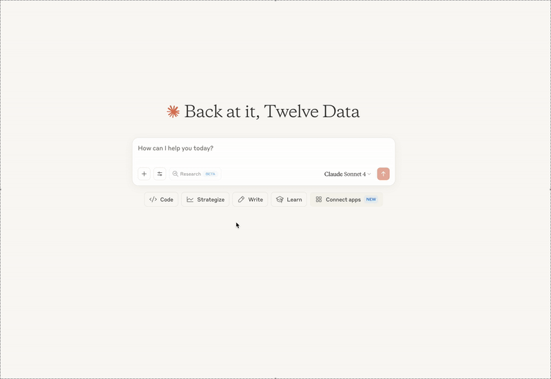

# Twelve Data MCP Server

## Overview

The Twelve Data MCP Server provides a seamless integration with the Twelve Data API to access financial market data. It enables retrieval of historical time series, real-time quotes, and instrument metadata for stocks, forex pairs, and cryptocurrencies.

> Note: This server is currently in early-stage development; features and tools may evolve alongside updates to the Twelve Data API.

## Obtaining Your API Key

To use Twelve Data MCP Server, you must first obtain an API key from Twelve Data:

1. Visit [Twelve Data Sign Up](https://twelvedata.com/register?utm_source=github&utm_medium=repository&utm_campaign=mcp_repo).
2. Create an account or log in if you already have one.
3. Navigate to your Dashboard and copy your API key.

Important: Access to specific endpoints or markets may vary depending on your Twelve Data subscription plan.

## Tools

1. **`time_series`**
   Fetch historical price data for a symbol.

   * **Inputs:**

     * `symbol` (string): Ticker, e.g. `AAPL`
     * `interval` (string): Data interval, e.g. `1min`, `1day`
     * `start_date` (string, optional): ISO-8601 start timestamp
     * `end_date` (string, optional): ISO-8601 end timestamp
   * **Returns:** Array of OHLCV bars.

2. **`price`**
   Get the latest price for a symbol.

   * **Inputs:**

     * `symbol` (string)
   * **Returns:** Latest price quote.

3. **`stocks`**
   List available stock instruments.

   * **Inputs:**

     * `exchange` (string, optional): Exchange code to filter by
   * **Returns:** Array of stock metadata.

4. **`forex_pairs`**
   List available forex pairs.

   * **Inputs:** none
   * **Returns:** Array of forex pair metadata.

5. **`cryptocurrencies`**
   List available cryptocurrencies.

   * **Inputs:** none
   * **Returns:** Array of cryptocurrency metadata.

## Installation

### Using **UV** (recommended)

Directly run without local installation using [`uvx`](https://docs.astral.sh/uv/guides/tools/):

```bash
uvx mcp-server-twelve-data --help
```

### Using **pip**

Install the server via pip:

```bash
pip install mcp-server-twelve-data
python -m mcp_server_twelve_data --help
```

## Configuration

### Claude Desktop integration

Add the following snippet to your `claude_desktop_config.json`:

```json
{
  "mcpServers": {
    "twelvedata": {
      "command": "uvx",
      "args": ["mcp-server-twelve-data@latest", "-k", "YOUR_TWELVE_DATA_API_KEY"]
    }
  }
}
```


or this one, to use our remote http server

```json
{
  "mcpServers": {
    "twelvedata-remote": {
      "command": "npx",
      "args":    [
        "mcp-remote", "https://mcp.twelvedata.com/mcp/",
        "--header",
        "Authorization:${AUTH_HEADER}",
        "X-OpenAPI-Key:${AUTH_HEADER}"
      ],
      "env": {
        "AUTH_HEADER": "apikey YOUR_TWELVE_DATA_API_KEY",
        "OPEN_API_KEY": "YOUR_OPEN_API_KEY"
      }
    }
  }
}
```

See how easy it is to connect Claude Desktop to Twelve Data MCP Server:



### VS Code integration

#### Automatic setup (with UV)

[](https://insiders.vscode.dev/redirect/mcp/install?name=twelvedata&config=%7B%22command%22%3A%22uvx%22%2C%22args%22%3A%5B%22mcp-server-twelve-data%22%2C%22-k%22%2C%YOUR_TWELVE_DATA_API_KEY%22%5D%7D)

#### Manual setup

For manual configuration, add to your **User Settings (JSON)**:

```json
{
  "mcp": {
    "servers": {
      "twelvedata": {
        "command": "uvx",
        "args": [
          "mcp-server-twelve-data@latest",
          "-t", "streamable-http",
          "-k", "YOUR_TWELVE_DATA_API_KEY"
        ]
      }
    }
  }
}
```

## Debugging

Use the MCP Inspector for troubleshooting:

```bash
npx @modelcontextprotocol/inspector uvx mcp-server-twelve-data@latest -k YOUR_TWELVE_DATA_API_KEY
```

## Development guide

1. **Local testing:** Utilize the MCP Inspector as described in **Debugging**.
2. **Claude Desktop:**: Update `claude_desktop_config.json` to reference local source paths.

## Docker usage

Build and run the server using Docker:

```bash
docker build -t mcp-server-twelve-data .
docker run --rm mcp-server-twelve-data -k YOUR_TWELVE_DATA_API_KEY
```

## U-tool
u-tool is an AI-powered universal router for the Twelve Data API that transforms how you access financial data. Instead of navigating 100+ individual endpoints and complex documentation, simply describe what you need in plain English.

How it works:
🧠 Natural Language Processing: Understands your request in conversational English
🔍 Smart Routing: Uses vector search to find the most relevant endpoints from Twelve Data's entire API catalog
🎯 Intelligent Selection: Leverages OpenAI GPT-4o to choose the optimal method and generate correct parameters
⚡ Automatic Execution: Calls the appropriate endpoint and returns formatted results

What you can ask:
📈 "Show me Apple stock performance this week"
📊 "Calculate RSI for Bitcoin with 14-day period" 
💰 "Get Tesla's financial ratios and balance sheet"
🌍 "Compare EUR/USD exchange rates over 6 months"
🏦 "Find top-performing tech ETFs"

Supported data categories:
- Market data & quotes • Technical indicators (100+)
- Fundamental data & financials • Currencies & crypto
- Mutual funds & ETFs • Economic calendars & events

One tool, entire Twelve Data ecosystem. No API documentation required.
```json
{
  "mcpServers": {
    "twelvedata": {
      "command": "uvx",
      "args": ["mcp-server-twelve-data@latest", "-k", "YOUR_TWELVE_DATA_API_KEY", "-u", "YOUR_OPEN_AI_APIKEY"]
    }
  }
}
```

## License

This MCP server is licensed under the MIT License. See the [LICENSE](../../LICENSE) file for details.
